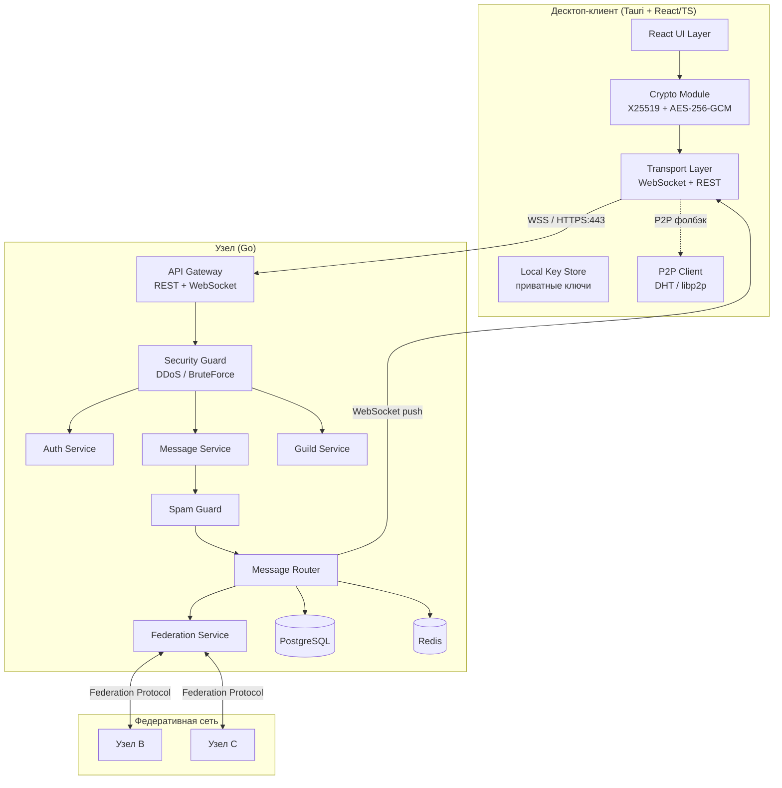
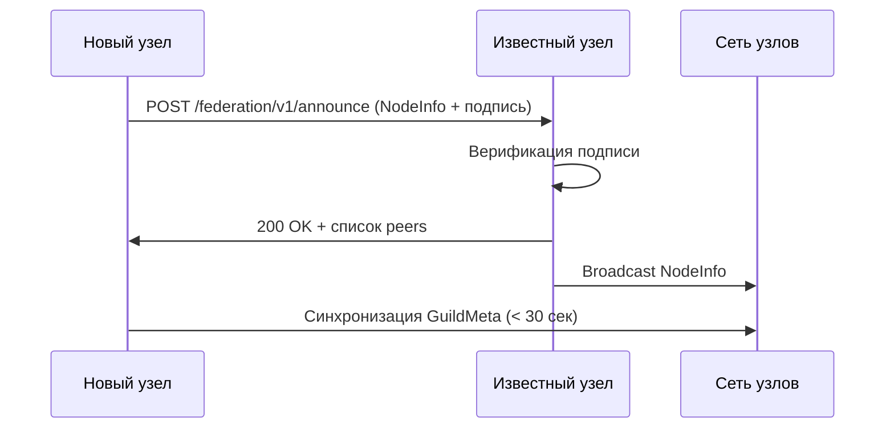
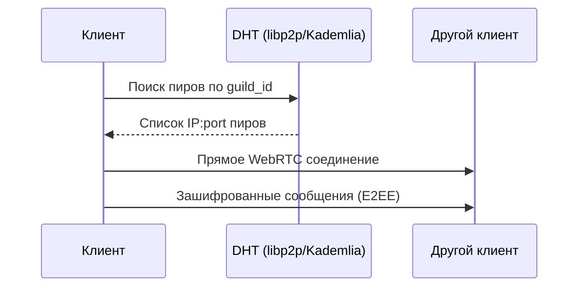

# Технический дизайн: Discord Alternative

## Обзор

Децентрализованный мессенджер с федеративной архитектурой, сквозным шифрованием и устойчивостью к блокировкам. Стек: Go (бэкенд/узел) + Tauri + React/TypeScript (десктоп-клиент для Windows, macOS, Linux).

Ключевые принципы:
- Отсутствие единой точки отказа — федерация независимых узлов
- Сквозное шифрование (E2EE) — узлы хранят только зашифрованные данные
- Устойчивость к блокировкам — транспорт поверх HTTPS/443, обфускация, P2P-фолбэк
- Безопасность по умолчанию — TLS 1.3, Argon2, rate limiting, валидация схем

---

## Архитектура

### Высокоуровневая схема



### Компоненты и их ответственность

| Компонент | Язык | Ответственность |
|---|---|---|
| React UI | TypeScript | Отображение, пользовательский ввод |
| Crypto Module | TypeScript (WebCrypto) | E2EE: генерация ключей, шифрование/дешифрование |
| Transport Layer | TypeScript | WebSocket-соединение, переключение узлов, обфускация |
| Tauri Shell | Rust | Нативный контейнер, системные уведомления, хранилище ключей |
| API Gateway | Go | Маршрутизация запросов, TLS-терминация, валидация схем |
| Auth Service | Go | Регистрация, аутентификация, JWT, управление сессиями |
| Message Service | Go | CRUD сообщений, история, редактирование/удаление |
| Guild Service | Go | Серверы, каналы, роли, права доступа |
| Message Router | Go | Доставка сообщений подписчикам через WebSocket hub |
| Spam Guard | Go | Rate limiting, антиспам-фильтры, муты/баны |
| Security Guard | Go | DDoS-защита, брутфорс-защита, IP-блокировки |
| Federation Service | Go | Межузловой протокол, синхронизация метаданных |
| PostgreSQL | — | Персистентное хранилище (пользователи, серверы, сообщения) |
| Redis | — | Сессии, rate limit счётчики, WebSocket hub состояние |

---

## Компоненты и интерфейсы

### Клиентская сторона (TypeScript)

#### Crypto Module

```typescript
interface CryptoModule {
  // Генерация пары ключей при регистрации
  generateKeyPair(): Promise<{ publicKey: CryptoKey; privateKey: CryptoKey }>;

  // Экспорт публичного ключа для передачи на сервер
  exportPublicKey(key: CryptoKey): Promise<string>; // base64

  // ECDH обмен ключами для получения общего секрета
  deriveSharedSecret(myPrivateKey: CryptoKey, theirPublicKey: CryptoKey): Promise<CryptoKey>;

  // Шифрование сообщения (AES-256-GCM)
  encrypt(plaintext: string, key: CryptoKey): Promise<EncryptedPayload>;

  // Дешифрование сообщения
  decrypt(payload: EncryptedPayload, key: CryptoKey): Promise<string>;

  // Forward secrecy: ротация ключей сессии
  rotateSessionKey(channelId: string): Promise<void>;
}

interface EncryptedPayload {
  ciphertext: string; // base64
  iv: string;         // base64, 12 байт для GCM
  tag: string;        // base64, 16 байт auth tag
  keyId: string;      // идентификатор версии ключа
}
```

#### Transport Layer

```typescript
interface TransportLayer {
  connect(nodeUrl: string): Promise<void>;
  disconnect(): void;

  // Автоматическое переключение при недоступности узла
  switchToFallback(): Promise<void>;

  send(event: WSEvent): void;
  subscribe(eventType: string, handler: (event: WSEvent) => void): () => void;

  // REST запросы через тот же транспорт
  request<T>(method: string, path: string, body?: unknown): Promise<T>;
}
```

### Серверная сторона (Go)

#### WebSocket Hub

```go
type Hub struct {
    // channelID -> set of client connections
    channels map[string]map[*Client]bool
    // userID -> set of client connections (для личных уведомлений)
    users    map[string]map[*Client]bool
    mu       sync.RWMutex
}

type Client struct {
    UserID    string
    ConnID    string
    Send      chan []byte
    GuildIDs  []string
}

func (h *Hub) Broadcast(channelID string, msg []byte) {}
func (h *Hub) BroadcastToUser(userID string, msg []byte) {}
func (h *Hub) Subscribe(client *Client, channelID string) {}
func (h *Hub) Unsubscribe(client *Client, channelID string) {}
```

#### Federation Service Interface

```go
type FederationService interface {
    // Анонс нового узла в сети
    AnnounceNode(ctx context.Context, node NodeInfo) error

    // Синхронизация метаданных сервера (без содержимого сообщений)
    SyncGuildMeta(ctx context.Context, guildID string) error

    // Пересылка сообщения на удалённый узел
    ForwardMessage(ctx context.Context, targetNode string, msg FederatedMessage) error

    // Получение списка известных узлов
    GetPeers(ctx context.Context) ([]NodeInfo, error)
}
```

---

## Модели данных

### PostgreSQL схема

```sql
-- Пользователи
CREATE TABLE users (
    id          UUID PRIMARY KEY DEFAULT gen_random_uuid(),
    username    VARCHAR(32) UNIQUE NOT NULL,
    password_hash TEXT NOT NULL,          -- Argon2id
    public_key  TEXT NOT NULL,            -- X25519 публичный ключ, base64
    created_at  TIMESTAMPTZ DEFAULT NOW(),
    updated_at  TIMESTAMPTZ DEFAULT NOW()
);

-- Серверы (гильдии)
CREATE TABLE guilds (
    id          UUID PRIMARY KEY DEFAULT gen_random_uuid(),
    name        VARCHAR(100) NOT NULL,
    owner_id    UUID NOT NULL REFERENCES users(id),
    node_id     VARCHAR(255) NOT NULL,    -- домен/IP узла-хозяина
    created_at  TIMESTAMPTZ DEFAULT NOW()
);

-- Каналы
CREATE TABLE channels (
    id          UUID PRIMARY KEY DEFAULT gen_random_uuid(),
    guild_id    UUID NOT NULL REFERENCES guilds(id) ON DELETE CASCADE,
    name        VARCHAR(100) NOT NULL,
    type        VARCHAR(10) NOT NULL CHECK (type IN ('text', 'voice')),
    position    INT NOT NULL DEFAULT 0,
    created_at  TIMESTAMPTZ DEFAULT NOW()
);

-- Роли
CREATE TABLE roles (
    id          UUID PRIMARY KEY DEFAULT gen_random_uuid(),
    guild_id    UUID NOT NULL REFERENCES guilds(id) ON DELETE CASCADE,
    name        VARCHAR(50) NOT NULL,
    level       INT NOT NULL,             -- 0=участник, 10=модератор, 50=администратор, 100=владелец
    permissions BIGINT NOT NULL DEFAULT 0 -- битовая маска прав
);

-- Участники серверов
CREATE TABLE guild_members (
    guild_id    UUID NOT NULL REFERENCES guilds(id) ON DELETE CASCADE,
    user_id     UUID NOT NULL REFERENCES users(id) ON DELETE CASCADE,
    role_id     UUID REFERENCES roles(id),
    joined_at   TIMESTAMPTZ DEFAULT NOW(),
    banned      BOOLEAN NOT NULL DEFAULT FALSE,
    muted_until TIMESTAMPTZ,
    PRIMARY KEY (guild_id, user_id)
);

-- Пригласительные ссылки
CREATE TABLE invites (
    code        VARCHAR(16) PRIMARY KEY,
    guild_id    UUID NOT NULL REFERENCES guilds(id) ON DELETE CASCADE,
    created_by  UUID NOT NULL REFERENCES users(id),
    expires_at  TIMESTAMPTZ,
    max_uses    INT,
    uses        INT NOT NULL DEFAULT 0
);

-- Сообщения (хранятся зашифрованными)
CREATE TABLE messages (
    id          UUID PRIMARY KEY DEFAULT gen_random_uuid(),
    channel_id  UUID NOT NULL REFERENCES channels(id) ON DELETE CASCADE,
    author_id   UUID NOT NULL REFERENCES users(id),
    ciphertext  TEXT NOT NULL,            -- зашифрованное содержимое
    iv          TEXT NOT NULL,            -- вектор инициализации
    key_id      TEXT NOT NULL,            -- версия ключа шифрования
    edited      BOOLEAN NOT NULL DEFAULT FALSE,
    deleted     BOOLEAN NOT NULL DEFAULT FALSE,
    created_at  TIMESTAMPTZ DEFAULT NOW(),
    updated_at  TIMESTAMPTZ DEFAULT NOW()
);
CREATE INDEX idx_messages_channel_created ON messages(channel_id, created_at DESC);

-- Журнал безопасности
CREATE TABLE security_log (
    id          BIGSERIAL PRIMARY KEY,
    event_type  VARCHAR(50) NOT NULL,     -- 'auth_fail', 'ip_blocked', 'spam_detected', ...
    ip_address  INET,
    user_id     UUID REFERENCES users(id),
    details     JSONB,
    created_at  TIMESTAMPTZ DEFAULT NOW()
);
CREATE INDEX idx_security_log_created ON security_log(created_at DESC);
CREATE INDEX idx_security_log_ip ON security_log(ip_address, created_at DESC);

-- Федеративные узлы
CREATE TABLE federation_nodes (
    id          UUID PRIMARY KEY DEFAULT gen_random_uuid(),
    domain      VARCHAR(255) UNIQUE NOT NULL,
    public_key  TEXT NOT NULL,            -- для верификации подписей
    last_seen   TIMESTAMPTZ,
    status      VARCHAR(20) DEFAULT 'active'
);
```

### Go структуры (доменные модели)

```go
type User struct {
    ID           uuid.UUID `json:"id"`
    Username     string    `json:"username"`
    PublicKey    string    `json:"public_key"`
    CreatedAt    time.Time `json:"created_at"`
}

type Message struct {
    ID        uuid.UUID        `json:"id"`
    ChannelID uuid.UUID        `json:"channel_id"`
    AuthorID  uuid.UUID        `json:"author_id"`
    Payload   EncryptedPayload `json:"payload"`
    Edited    bool             `json:"edited"`
    Deleted   bool             `json:"deleted"`
    CreatedAt time.Time        `json:"created_at"`
}

type EncryptedPayload struct {
    Ciphertext string `json:"ciphertext"` // base64
    IV         string `json:"iv"`         // base64
    KeyID      string `json:"key_id"`
}

type Guild struct {
    ID        uuid.UUID `json:"id"`
    Name      string    `json:"name"`
    OwnerID   uuid.UUID `json:"owner_id"`
    NodeID    string    `json:"node_id"`
    CreatedAt time.Time `json:"created_at"`
}

type Permission uint64

const (
    PermSendMessages  Permission = 1 << 0
    PermManageMessages Permission = 1 << 1
    PermKickMembers   Permission = 1 << 2
    PermBanMembers    Permission = 1 << 3
    PermManageRoles   Permission = 1 << 4
    PermManageGuild   Permission = 1 << 5
    PermViewChannel   Permission = 1 << 6
    PermConnect       Permission = 1 << 7  // голосовой канал
    PermSpeak         Permission = 1 << 8  // голосовой канал
)
```

### TypeScript модели (клиент)

```typescript
interface Message {
  id: string;
  channelId: string;
  authorId: string;
  authorUsername: string;
  payload: EncryptedPayload;
  decryptedContent?: string; // заполняется после дешифрования на клиенте
  edited: boolean;
  deleted: boolean;
  createdAt: string; // ISO 8601
}

interface Guild {
  id: string;
  name: string;
  ownerId: string;
  nodeId: string;
  channels: Channel[];
  members: Member[];
}

interface Channel {
  id: string;
  guildId: string;
  name: string;
  type: 'text' | 'voice';
  position: number;
}
```

---

## API дизайн

### REST Endpoints

#### Аутентификация

```
POST /api/v1/auth/register
Body: { username: string, password: string, public_key: string }
Response 201: { user_id: string, token: string }
Response 409: { error: "username_taken" }

POST /api/v1/auth/login
Body: { username: string, password: string }
Response 200: { token: string, user: User }
Response 401: { error: "invalid_credentials" }

POST /api/v1/auth/logout
Headers: Authorization: Bearer <token>
Response 204
```

#### Серверы (гильдии)

```
POST /api/v1/guilds
Body: { name: string }
Response 201: Guild

GET /api/v1/guilds
Response 200: Guild[]

POST /api/v1/guilds/:guildId/invites
Body: { expires_in?: number, max_uses?: number }
Response 201: { code: string, expires_at: string }

POST /api/v1/invites/:code/join
Response 200: Guild
Response 410: { error: "invite_expired_or_invalid" }

DELETE /api/v1/guilds/:guildId/members/:userId
Response 204
Response 403: { error: "forbidden" }
```

#### Каналы и сообщения

```
POST /api/v1/guilds/:guildId/channels
Body: { name: string, type: "text" | "voice" }
Response 201: Channel

GET /api/v1/channels/:channelId/messages?before=<messageId>&limit=50
Response 200: Message[]

POST /api/v1/channels/:channelId/messages
Body: { payload: EncryptedPayload }
Response 201: Message
Response 429: { error: "rate_limited", retry_after: number }

PATCH /api/v1/messages/:messageId
Body: { payload: EncryptedPayload }
Response 200: Message

DELETE /api/v1/messages/:messageId
Response 204
```

#### Роли и права

```
POST /api/v1/guilds/:guildId/roles
Body: { name: string, permissions: number }
Response 201: Role

PATCH /api/v1/guilds/:guildId/members/:userId/role
Body: { role_id: string }
Response 200: Member

POST /api/v1/guilds/:guildId/members/:userId/mute
Body: { duration_seconds: number, channel_ids?: string[] }
Response 204

POST /api/v1/guilds/:guildId/members/:userId/ban
Response 204
```

#### Федерация (межузловые)

```
POST /federation/v1/announce
Body: NodeInfo (подписано приватным ключом узла)
Response 200

POST /federation/v1/message
Body: FederatedMessage (подписано)
Response 202

GET /federation/v1/guild/:guildId/meta
Response 200: GuildMeta (без содержимого сообщений)

GET /federation/v1/peers
Response 200: NodeInfo[]
```

### WebSocket события

Соединение: `wss://node.example.com/ws?token=<jwt>`

#### Клиент → Сервер

```typescript
// Подписка на канал
{ type: "subscribe", channel_id: string }

// Отписка от канала
{ type: "unsubscribe", channel_id: string }

// Отправка сообщения (альтернатива REST для низкой задержки)
{ type: "message.send", channel_id: string, payload: EncryptedPayload }

// Голосовой канал: сигнализация WebRTC
{ type: "voice.signal", channel_id: string, target_user_id: string, sdp: RTCSessionDescription }
{ type: "voice.ice", channel_id: string, target_user_id: string, candidate: RTCIceCandidate }
{ type: "voice.join", channel_id: string }
{ type: "voice.leave", channel_id: string }

// Heartbeat
{ type: "ping" }
```

#### Сервер → Клиент

```typescript
// Новое сообщение
{ type: "message.new", message: Message }

// Сообщение отредактировано
{ type: "message.edited", message_id: string, payload: EncryptedPayload, edited: true }

// Сообщение удалено
{ type: "message.deleted", message_id: string, channel_id: string }

// Участник присоединился к голосовому каналу
{ type: "voice.user_joined", channel_id: string, user: User }

// Участник покинул голосовой канал
{ type: "voice.user_left", channel_id: string, user_id: string }

// WebRTC сигнализация (проксируется между клиентами)
{ type: "voice.signal", from_user_id: string, sdp: RTCSessionDescription }
{ type: "voice.ice", from_user_id: string, candidate: RTCIceCandidate }

// Уведомление о муте/бане
{ type: "member.muted", user_id: string, until: string, channel_ids: string[] }
{ type: "member.banned", user_id: string, guild_id: string }

// Уведомление о нестабильном соединении (от клиента к клиенту через сервер)
{ type: "system.node_switching", next_node: string }

// Heartbeat ответ
{ type: "pong" }
```

---

## Компоненты безопасности

### Защита от спама (Spam Guard)

Реализован как middleware в Go с использованием Redis для хранения счётчиков.

```go
type SpamGuard struct {
    redis  *redis.Client
    config SpamConfig
}

type SpamConfig struct {
    BurstLimit      int           // 5 сообщений
    BurstWindow     time.Duration // 5 секунд
    BurstCooldown   time.Duration // 30 секунд
    RepeatThreshold int           // 3 превышения
    RepeatWindow    time.Duration // 10 минут
    RepeatCooldown  time.Duration // 10 минут
}

// Алгоритм: Token Bucket + счётчик нарушений
func (sg *SpamGuard) CheckMessage(ctx context.Context, userID, channelID string) error {
    key := fmt.Sprintf("spam:%s:%s", userID, channelID)
    // Атомарный инкремент + TTL через Lua-скрипт в Redis
    // Возвращает ErrRateLimited если превышен лимит
}
```

Антиспам-фильтры (проверяются до доставки):
- Повторяющийся текст: расстояние Левенштейна < 10% от длины для последних 3 сообщений
- Массовые упоминания: более 5 `@mention` в одном сообщении
- Запрещённые ссылки: проверка по списку доменов (обновляемый blocklist)
- Длина сообщения: максимум 4000 символов

### Защита от DDoS и брутфорса (Security Guard)

```go
type SecurityGuard struct {
    redis  *redis.Client
    config SecurityConfig
}

type SecurityConfig struct {
    DDoSConnLimit    int           // 1000 соединений/сек с одного IP
    DDoSBlockTime    time.Duration // 60 секунд
    BruteForceLimit  int           // 10 попыток/мин
    BruteForceBlock  time.Duration // 15 минут
}

// IP-блокировка хранится в Redis с TTL
// Проверяется на уровне nginx/reverse proxy + в Go middleware
```

Слои защиты:
1. **Nginx/Reverse Proxy**: первичная фильтрация по IP, rate limiting на уровне соединений
2. **Go Middleware**: проверка Redis-блоклиста, счётчики аутентификации
3. **Application Layer**: валидация схем, параметризованные запросы, экранирование

### Хранение паролей

```go
// Argon2id с параметрами: memory=64MB, iterations=3, parallelism=4
func HashPassword(password string) (string, error) {
    salt := make([]byte, 16)
    rand.Read(salt)
    hash := argon2.IDKey([]byte(password), salt, 3, 64*1024, 4, 32)
    // Формат: $argon2id$v=19$m=65536,t=3,p=4$<salt_b64>$<hash_b64>
    return encodeArgon2Hash(salt, hash), nil
}
```

### TLS и транспортная безопасность

- TLS 1.3 обязателен (TLS 1.2 как минимум)
- Certificate pinning в Tauri-клиенте для известных узлов
- WebSocket соединения только через WSS
- Все REST запросы через HTTPS

### Обфускация трафика

```go
// Transport Layer поддерживает режим обфускации:
// - Трафик оборачивается в стандартные HTTPS-запросы (HTTP/2 multiplexing)
// - WebSocket маскируется под long-polling если WS заблокирован
// - Случайные padding-байты добавляются к пакетам для затруднения DPI
type ObfuscationMode int
const (
    ObfuscationNone    ObfuscationMode = 0
    ObfuscationHTTPS   ObfuscationMode = 1 // трафик через HTTPS/443
    ObfuscationPadding ObfuscationMode = 2 // случайный padding
)
```

---

## Федеративный протокол

### Принципы

- Каждый узел идентифицируется доменным именем и парой ключей Ed25519
- Все межузловые сообщения подписываются приватным ключом узла-отправителя
- Узлы хранят только метаданные чужих серверов, не содержимое сообщений
- Доверие устанавливается через Web of Trust или ручное добавление узлов

### Структуры федеративного протокола

```go
type NodeInfo struct {
    Domain    string    `json:"domain"`
    PublicKey string    `json:"public_key"` // Ed25519, base64
    Version   string    `json:"version"`
    Timestamp time.Time `json:"timestamp"`
    Signature string    `json:"signature"`  // подпись всего объекта
}

type FederatedMessage struct {
    ID         string          `json:"id"`
    OriginNode string          `json:"origin_node"`
    GuildID    string          `json:"guild_id"`
    ChannelID  string          `json:"channel_id"`
    Message    Message         `json:"message"`
    Timestamp  time.Time       `json:"timestamp"`
    Signature  string          `json:"signature"`
}

type GuildMeta struct {
    GuildID   string    `json:"guild_id"`
    Name      string    `json:"name"`
    NodeID    string    `json:"node_id"`
    Channels  []Channel `json:"channels"` // только метаданные, без сообщений
    UpdatedAt time.Time `json:"updated_at"`
}
```

### Процесс присоединения нового узла



### P2P фолбэк

При недоступности всех известных узлов клиент переходит в P2P-режим:



Реализация P2P:
- Обнаружение пиров через Kademlia DHT (библиотека `libp2p` или `go-libp2p`)
- Прямое соединение через WebRTC DataChannel (NAT traversal через STUN/TURN)
- Те же E2EE ключи — P2P не снижает уровень шифрования

---

## Обработка ошибок

### Коды ошибок

| HTTP код | Ситуация |
|---|---|
| 400 | Невалидные входные данные (не соответствует схеме) |
| 401 | Не аутентифицирован или токен истёк |
| 403 | Недостаточно прав |
| 404 | Ресурс не найден |
| 409 | Конфликт (имя пользователя занято) |
| 410 | Пригласительная ссылка истекла или недействительна |
| 429 | Rate limit превышен |
| 500 | Внутренняя ошибка сервера |

### Формат ошибок

```json
{
  "error": "rate_limited",
  "message": "Превышен лимит отправки сообщений",
  "retry_after": 30,
  "details": {}
}
```

### Стратегия переключения узлов (клиент)

```typescript
class TransportLayer {
  private nodes: string[] = [];      // минимум 3 узла
  private currentNodeIndex = 0;

  async switchToFallback(): Promise<void> {
    // Перебираем узлы по кругу, таймаут 5 секунд
    for (let i = 1; i <= this.nodes.length; i++) {
      const nextIndex = (this.currentNodeIndex + i) % this.nodes.length;
      try {
        await this.connect(this.nodes[nextIndex]);
        this.currentNodeIndex = nextIndex;
        return;
      } catch {
        continue;
      }
    }
    // Все узлы недоступны — переход в P2P
    await this.p2pClient.activate();
  }
}
```

---

## Свойства корректности


*Свойство — это характеристика или поведение, которое должно выполняться при всех валидных выполнениях системы. Свойства служат мостом между читаемыми человеком спецификациями и машинно-верифицируемыми гарантиями корректности.*

**Property Reflection (устранение избыточности):**
- Свойства 6.1 (AES-256-GCM шифрование) и 6.6 (round-trip корректность) объединяются в одно: round-trip шифрования уже доказывает корректность алгоритма
- Свойства 9.3 (спам не доставляется) и 9.4 (код 429) объединяются: если возвращается 429, сообщение не доставлено
- Свойства 10.2 (лимит 10 попыток) и 10.3 (блокировка после 10 попыток) объединяются в одно свойство брутфорс-защиты
- Свойства 1.3 (регистрация за 3 сек) и 2.4 (вступление за 2 сек) — разные операции, оставляем отдельно

### Свойство 1: Round-trip шифрования

*Для любого* plaintext-сообщения и пары ключей X25519, операция шифрования (AES-256-GCM) с последующим дешифрованием должна возвращать исходное сообщение без изменений.

**Validates: Requirements 6.1, 6.2, 6.6**

### Свойство 2: Генерация ключей при регистрации

*Для любых* валидных учётных данных (имя пользователя, пароль), после успешной регистрации должна существовать криптографическая пара ключей, приватный ключ сохранён локально, публичный ключ передан на узел.

**Validates: Requirements 1.2**

### Свойство 3: Уникальность имён пользователей

*Для любого* уже зарегистрированного имени пользователя, повторная попытка регистрации с тем же именем должна возвращать код ошибки 409.

**Validates: Requirements 1.4**

### Свойство 4: Безопасность сообщений об ошибках аутентификации

*Для любых* некорректных учётных данных (неверный логин, неверный пароль, или оба), сообщение об ошибке не должно раскрывать конкретную причину отказа.

**Validates: Requirements 1.6**

### Свойство 5: Создатель сервера становится администратором

*Для любого* аутентифицированного пользователя, создающего сервер с уникальным именем, этот пользователь должен получить роль администратора в созданном сервере.

**Validates: Requirements 2.1**

### Свойство 6: Валидность пригласительных ссылок

*Для любой* истёкшей или недействительной пригласительной ссылки, попытка вступления должна возвращать код ошибки 410.

**Validates: Requirements 2.5**

### Свойство 7: Прекращение доставки после удаления участника

*Для любого* участника, удалённого с сервера, все последующие сообщения в каналах этого сервера не должны доставляться удалённому участнику.

**Validates: Requirements 2.6**

### Свойство 8: Шифрование перед отправкой

*Для любого* сообщения, отправляемого клиентом, данные, передаваемые на узел, не должны содержать исходный plaintext — только зашифрованный payload с IV и key_id.

**Validates: Requirements 3.1**

### Свойство 9: Корректность редактирования сообщений

*Для любого* сообщения, после операции редактирования, узел должен сохранить новый зашифрованный payload и установить флаг `edited = true`.

**Validates: Requirements 3.5**

### Свойство 10: Rate limiting — базовый

*Для любого* участника и канала, отправка более 5 сообщений в течение 5 секунд должна приводить к блокировке отправки на 30 секунд, а ответ на превышающее сообщение должен содержать код 429.

**Validates: Requirements 9.1, 9.4**

### Свойство 11: Rate limiting — эскалация

*Для любого* участника, трёхкратное последовательное превышение базового лимита в течение 10 минут должно приводить к увеличению длительности блокировки до 10 минут.

**Validates: Requirements 9.2**

### Свойство 12: Антиспам-фильтрация

*Для любого* сообщения, определённого антиспам-фильтром как спам (повторяющийся текст, массовые упоминания, запрещённые ссылки), оно не должно быть доставлено получателям.

**Validates: Requirements 9.3**

### Свойство 13: Валидация входных данных

*Для любых* входных данных, не соответствующих ожидаемой схеме (неверный тип, длина, символы), узел должен возвращать код 400 без выполнения каких-либо операций с полученными данными.

**Validates: Requirements 10.4, 10.5**

### Свойство 14: Брутфорс-защита

*Для любого* IP-адреса, после 10 неудачных попыток аутентификации в течение 1 минуты, этот IP должен быть заблокирован на 15 минут, а все последующие попытки аутентификации с него должны быть отклонены.

**Validates: Requirements 10.2, 10.3**

### Свойство 15: Минимальное количество резервных узлов

*Для любого* сервера (гильдии), маршрутизатор должен поддерживать список из не менее 3 альтернативных узлов для обеспечения отказоустойчивости.

**Validates: Requirements 5.1**

---

## Стратегия тестирования

### Подход

Используется двойная стратегия: property-based тесты для универсальных свойств + unit/integration тесты для конкретных сценариев.

**Библиотеки:**
- Go (бэкенд): [`pgregory.net/rapid`](https://github.com/pgregory/rapid) — property-based testing
- TypeScript (клиент): [`fast-check`](https://github.com/dubzzz/fast-check) — property-based testing

**Конфигурация:** минимум 100 итераций на каждый property-тест.

**Тег формат:** `Feature: discord-alternative, Property N: <краткое описание>`

### Property-based тесты

Каждое свойство из раздела "Свойства корректности" реализуется одним property-тестом:

```go
// Go пример — Свойство 1: Round-trip шифрования
// Feature: discord-alternative, Property 1: encrypt-decrypt round trip
func TestEncryptDecryptRoundTrip(t *testing.T) {
    rapid.Check(t, func(t *rapid.T) {
        plaintext := rapid.StringOf(rapid.Rune()).Draw(t, "plaintext")
        key := generateRandomAES256Key(t)
        
        encrypted, err := Encrypt(plaintext, key)
        require.NoError(t, err)
        
        decrypted, err := Decrypt(encrypted, key)
        require.NoError(t, err)
        
        assert.Equal(t, plaintext, decrypted)
    })
}
```

```typescript
// TypeScript пример — Свойство 10: Rate limiting
// Feature: discord-alternative, Property 10: rate limiting basic
test('rate limiting blocks after 5 messages in 5 seconds', () => {
  fc.assert(fc.asyncProperty(
    fc.uuid(), fc.uuid(), // userID, channelID
    async (userID, channelID) => {
      const guard = new SpamGuard(mockRedis);
      // Отправляем 5 сообщений — должны пройти
      for (let i = 0; i < 5; i++) {
        await expect(guard.checkMessage(userID, channelID)).resolves.not.toThrow();
      }
      // 6-е сообщение — должно быть заблокировано
      await expect(guard.checkMessage(userID, channelID)).rejects.toThrow('rate_limited');
    }
  ), { numRuns: 100 });
});
```

### Unit тесты

Фокус на конкретных примерах и граничных условиях:

- Регистрация с граничными значениями имени (1 символ, 32 символа, спецсимволы)
- Аутентификация с различными комбинациями неверных данных
- Создание сервера с дублирующимся именем
- Загрузка истории канала (ровно 50, меньше 50, пустой канал)
- Форматирование текста (жирный, курсив, код, блок кода, ссылки)
- Права доступа: попытка действия без нужной роли → 403
- Уведомления: @mention при статусе "Не беспокоить"

### Integration тесты

Тестирование взаимодействия компонентов:

- Полный flow регистрации → логин → создание сервера → отправка сообщения → получение
- Переключение узла при потере соединения (мок недоступного узла)
- Федеративная синхронизация метаданных между двумя тестовыми узлами
- WebRTC сигнализация для голосового канала
- P2P фолбэк при недоступности всех узлов

### Smoke тесты

- TLS соединение устанавливается с версией не ниже 1.2
- Пароли в БД хранятся только в виде хэша Argon2 (нет plaintext)
- Форма регистрации содержит поля username и password
- Узел стартует и принимает соединения

### Нагрузочное тестирование

- 10 000 одновременных WebSocket соединений при потреблении ≤ 4 ГБ RAM
- Доставка сообщения всем подписчикам канала в течение 500 мс
- Загрузка интерфейса и установка соединения в течение 3 секунд при 1 Мбит/с
